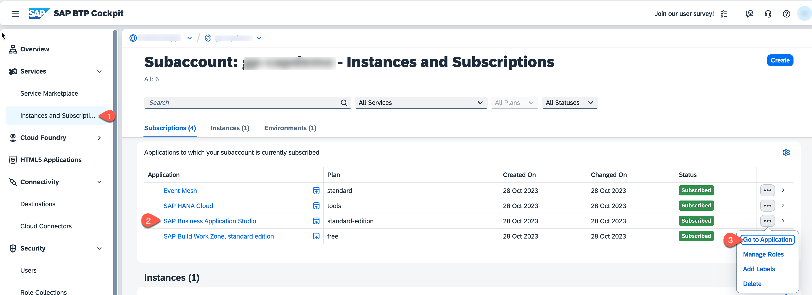
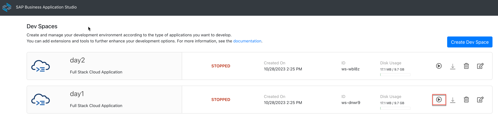

### Prerequisite

## Login to BTP Subaccount

1. Click [Here](https://emea.cockpit.btp.cloud.sap/cockpit/?idp=tdct3ched1.accounts.ondemand.com#/globalaccount/e2a835b0-3011-4c79-818a-d7767c4627cd/subaccount/57b94b7a-2794-4054-95c9-ea692527815f/subaccountoverview) to go to BTP Subaccount.
2. Credential will be provided on Hands-on room.
3. Navigate to **Services** &rarr; **Instances and Subscriptions** &rarr; **SAP Business Application Studio** click on **Go to Application**

    

4. Two dev spaces have been created (day1 and day2). Click on the spaces as per day. Make sure dev spaces is up and running.
If not click on play button to start.

    

## Exercises

Below are the exercise link provided to be tried out.

- [Build a CAP Application](./exercises/Build%20a%20CAP%20Application/README.md)
- [Add Fiori Elements UIs](./exercises/Add%20Fiori%20Elements%20UIs/README.md)
- [Add Custom Logic](./exercises/Add%20Custom%20Logic/README.md)
- [Use a Local Launch Page](./exercises/Use%20a%20Local%20Launch%20Page/README.md)
- [Add Authorization](./exercises/Add%20Authorization/README.md)
- [Add Test Cases](./exercises/Add%20Test%20Cases/README.md)
- [Prepare for Production](./exercises/Prepare%20for%Production/README.md)
- [Deploy in SAP BTP, Cloud Foundry Runtime](./exercises/Deploy%20in%20SAP%20BTP,%20Cloud%20Foundry%20Runtime/README.md)
- [User Role Assignment](./exercises/User%20Role%20Assignment/README.md)
- [Integrate Your Application with SAP Build Work Zone, Standard Edition](./exercises/Integrate%20Your%20Application%20with%20SAP%20Build%20Work%20Zone,%20Standard%20Edition/README.md)
- [Explore APIs & events in SAP API Business Hub](./exercises/Explore%20APIs%20&%20events%20in%20SAP%20API%20Business%20Hub/README.md)
- [Implement Remote Service Connectivity](./exercises/Implement%20Remote%20Service%20Connectivity/README.md)
- [Local Testing of the Incident Management Application](./exercises/Local%20Testing%20of%20the%20Incident%20Management%20Application/README.md)
- [Deploy the application to SAP BTP Cloud Foundry Runtime](./exercises/Deploy%20the%20application%20to%20SAP%20BTP%20Cloud%20Foundry%20Runtime/README.md)
- [Test the end to end flow](./exercises/Test%20the%20end%20to%20end%20flow/README.md)