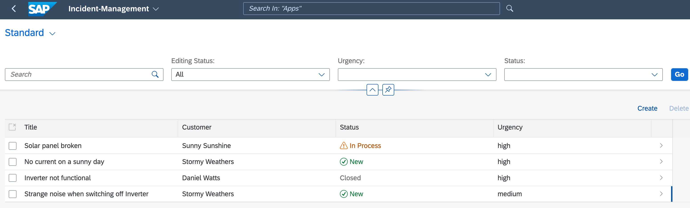

# Exercise 6 - Add Authorization

In this exercise we will learn
- How to add CAP role restrictions to entities
- How to add users for local testing
- How to access the Incident Management application with password


### Add CAP role restrictions to entities

1. Open the **srv/processor-service.cds** file.

2. To specify restrictions, add the following line to the **srv/processor-service.cds** file:

    ```javascript[10]
    using { sap.capire.incidents as my } from '../db/schema';

    /**
    * Used by support team members to process incidents
    */
    service ProcessorService  {
      ...
    }
    annotate ProcessorService.Incidents with @odata.draft.enabled; 
    annotate ProcessorService with @(requires: 'support');

    ...
    ```

With this change, a user with the **support** role can view and change the incidents and customers.

### Add users for local testing

The authorization checks that you added to the CAP model apply not only when deployed in the cloud but also when testing locally. Therefore, you need a way to log in to the application locally.

CAP offers a possibility to add local users for testing as part of the `cds` configuration. In this tutorial, you use the **development** profile in **package.json** file to add the users.

1. Open the **package.json** file in your project directory.
   
2. In the **package.json** file, add the following code:
    ```json[14-23]    
    {
      "name": "incident-management-xxx",
      "version": "1.0.0",
      "description": "A simple CAP project.",
      "repository": "<Add your repository here>",
      "license": "UNLICENSED",
      "private": true,
      "dependencies": {
        ...
      },
      "scripts": {
        ...
      },  
      "cds": {
        "requires": {
          "[development]": {
            "auth": {
              "kind": "mocked",
              "users": {}
            }
          }
        }
      },
      ...
    }
    ```

    The code creates the **cds.requires** section that didn't exist so far in the **package.json** file. Also, the code defines which configuration to use when running with the **development** profile. You define some general parameters for the authentication behavior. Notice that the users object is empty, in the next step, you will define some test users.

3. In the **package.json** file, replace the empty **users** object with the following code:

    ```json[6-17]
    "cds": {
        "requires": {
          "[development]": {
            "auth": {
              "kind": "mocked",
              "users": {
                "incident.support@tester.sap.com": {
                  "password": "initial",
                  "roles": ["support"]
                },
                "alice": {
                  "roles": ["support"]
                },
                "bob": {
                  "roles": ["support"]
                }
              }
            }
          }
        }
      
    ```

    Each user entry is part of the **users** object. The key is the **id** of the user and they can have different properties. For this scenario you define a **password** and an array of roles.
  
    You have added three users:

    - `incident.support@tester.sap.com` with the `support` role and the `initial` password
    - `alice` with the `support` role and no password
    - `bob` with the `support` role and no password

    > Keep in mind that the CAP roles and the Cloud Foundry roles and scopes are not the same thing. See [Authentication](https://cap.cloud.sap/docs/node.js/authentication) in the CAP documentation.

### Access the Incident Management application with a password

When accessing the **Incidents** service of the **Incident Management** application in your browser, you get a basic auth popup now, asking for your user and password. You can use the users to log in and
see how it works.

1. Make sure the SAP Fiori application is running. If you closed it, choose the **Preview Application** option in the **Application Info - incidentsxxx** tab and select the **watch-incidents** npm script.

    > To open the **Application Info - incidentxxxs** tab: 
    >
    >1. Invoke the Command Palette - **View** &rarr; **Command Palette** or <kbd>Command</kbd> + <kbd>Shift</kbd> + <kbd>P</kbd> for macOS / <kbd>Ctrl</kbd> + <kbd>Shift</kbd> + <kbd>P</kbd> for Windows. 
    >2. Choose **Fiori: Open Application Info**.


3. In the **Username** field of the auth popup, enter `incident.support@tester.sap.com`.

4. In the **Password** field, enter `initial`.

    

    You can now access the **Incident Management** application.

    

    > Currently, there’s no logout functionality. You can clear your browser's cache or simply close all browser windows to get rid of the login data in your browser. For Google Chrome, restart your browser (complete shutdown and restart) by entering `chrome://restart` in the address line.

