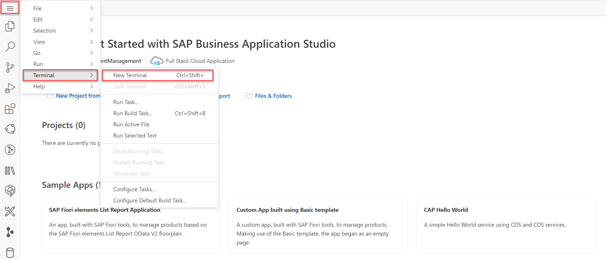
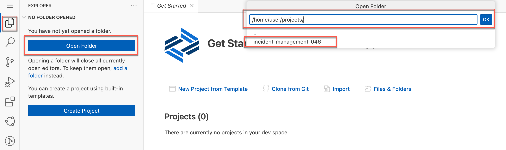
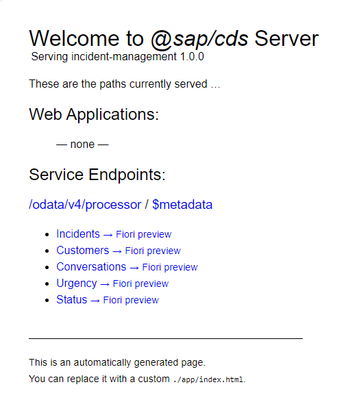
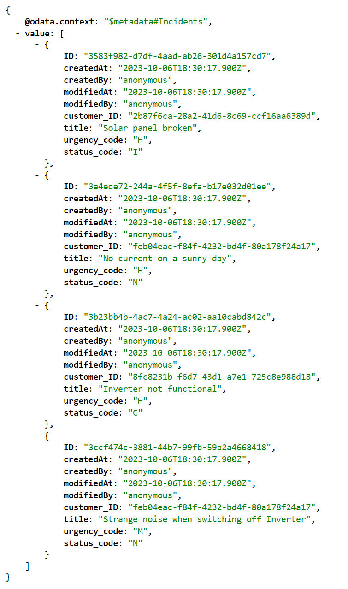
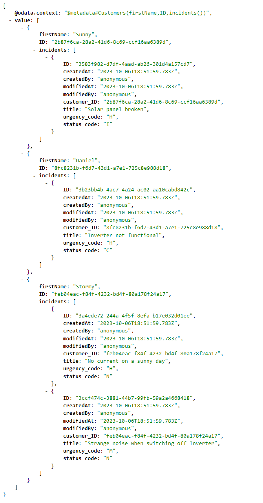
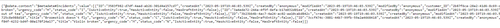
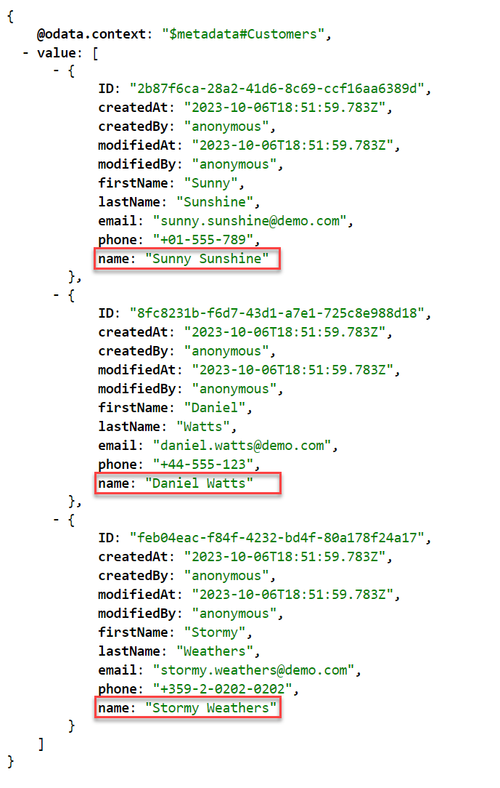

# Exercise 2 - Build a CAP application

In this exercise, we will learn
- How to create a CAP project
- How to add a domain model
- How to create services
- How to add data to your database
- How to add calculated elements

## Create a CAP project

1. In SAP Business Application Studio, go to your **day1/day2** dev space.

    > Make sure the **day1/day2** dev space is in status **RUNNING**.

2. Choose the burger menu and choose **Terminal** &rarr; **New Terminal**.

    

3. Navigate to the **projects** folder from the root directory.

    ```bash
    cd projects
    ```

    > Your main interaction will be through the `cds` command. It is used to build, run, and debug your CAP application. Besides that, you can also use `cds` to enrich your application with additional capabilities such as messaging, multitenancy, or cloud integration. You can learn more about the tool's capabilities in [Command Line Interface (CLI)](https://cap.cloud.sap/docs/tools/#command-line-interface-cli).

4. Create a new project using [`cds init`](https://cap.cloud.sap/docs/tools/#cds-init-add).
   Use your teched user number for `xxx`.
   Eg., If your teched user name is XP260-001, use 001 as the `xxx`.

    ```bash
    cds init incident-management-<xxx>
    ```

    > This command creates a folder `incident-management-<xxx>` with your newly created CAP project.

5. Choose the **Explorer** icon and then choose **Open Folder**. Type `/home/user/projects/` in the field and select `incident-management-xxx`. Choose **OK** to open the project in SAP Business Application Studio.

    

    > You can also use the **Ctrl+Shift+E** key combination to quickly navigate to the **Explorer**.
  
6. While you are in the `<incident-management-xxx>` folder, choose the burger menu and then choose **Terminal** &rarr; **New Terminal**.

    Now you can use the terminal to start a CAP server.

    ```bash
    cds watch
    ```

    The CAP server serves all the CAP sources from your project. It also "watches" all the files in your projects and conveniently restarts whenever you save a file. Changes you've made are immediately served without you having to run the command again. In this newly created project the CAP server tells you that there are no models or service definitions yet that it can serve.

    This is the output you should get:

    ```
    cds serve all --with-mocks --in-memory?
    live reload enabled for browsers

    ___________________________

    No models found in db/,srv/,app/,schema,services.
    Waiting for some to arrive...
    ```

## Add a domain model

1. In the **db** folder, create a new **schema.cds** file.

2. Paste the following code snippet in the **schema.cds** file.

    ```js
    using { User, cuid, managed, sap.common.CodeList } from '@sap/cds/common';
    namespace sap.capire.incidents;

    /**
     * Incidents created by Customers.
    */
    entity Incidents : cuid, managed {
      customer     : Association to Customers;
      title        : String  @title : 'Title';
      urgency      : Association to Urgency;
      status       : Association to Status; 
      conversations: Composition of many Conversations on conversations.incidents = $self;
    }

    /**
     * Customers entitled to create support Incidents.
    */
    entity Customers : cuid, managed {
      firstName     : String;
      lastName      : String;
      email         : EMailAddress;
      phone         : PhoneNumber;
      incidents     : Association to many Incidents on incidents.customer = $self;
    }

    entity Conversations : cuid, managed {
      incidents : Association to Incidents;
      timestamp : DateTime;
      author    : String @cds.on.insert: $user;
      message   : String;
    }

    entity Status : CodeList {
      key code: String enum {
          new = 'N';
          assigned = 'A'; 
          in_process = 'I'; 
          on_hold = 'H'; 
          resolved = 'R'; 
          closed = 'C'; 
      };
      criticality : Integer;
    }

    entity Urgency : CodeList {
      key code: String enum {
          high = 'H';
          medium = 'M'; 
          low = 'L'; 
      };
    }

    type EMailAddress : String;
    type PhoneNumber : String;
    type City : String;
    ```

As soon as you save your file, the CAP server that is still running reacts immediately with a new output:

```bash
[cds] - loaded model from 1 file(s):

  db/schema.cds

[cds] - connect using bindings from: { registry: '~/.cds-services.json' }
[cds] - connect to db > sqlite { database: ':memory:' }
/> successfully deployed to in-memory database. 
```

This means that the CAP server detected the changes in **schema.cds** and automatically created an in-memory SQLite database when restarting the server process. However, the CAP server also prints this message:

```bash
No service definitions found in loaded models.
Waiting for some to arrive...
```

## Create services

It's a good practice in CAP to create single-purpose services. Hence, let's define a `ProcessorService` for support engineers to process incidents created by customers.

To create the service definitions:

1. In the **srv** folder, create a new **processor-service.cds** file.

2. Paste the following code snippet in the **processor-service.cds** file:

    ```js
    using { sap.capire.incidents as my } from '../db/schema';

    service ProcessorService { 
      entity Incidents as projection on my.Incidents;
      entity Customers as projection on my.Customers;
      entity Conversations as projection on my.Conversations;
      entity Urgency as projection on my.Urgency;
      entity Status as projection on my.Status;
    }
    ```
  
This time, the CAP server reacted with additional output:

```bash
[cds] - serving ProcessorService { path: '/odata/v4/processor' }

[cds] - server listening on { url: 'http://localhost:4004' }
[cds] - [ terminate with ^C ]
```

As you can see in the log output, the new file created a generic service provider `ProcessorService` that serves requests on the `/odata/v4/processor` endpoint. If you open the link `http://localhost:4004` from SAP Business Application Studio in your browser, you'll see the generic `index.html` page:



You may have to stop the CAP server with <kbd>Ctrl</kbd> + <kbd>C</kbd> and start it again with the `cds watch` command.

## Generate comma-separated values (CSV) templates

Since we already have an SQLite in-memory database that was automatically created in the previous step, let's now fill it with some test data.

1. Run the following command in the **incident-management** root folder of your project:

    ```bash
    cds add data
    ```

2. Check the output.

    ```bash
    Adding feature 'data'...
    Creating db/data/sap.capire.incidents-Incidents.csv
    Creating db/data/sap.capire.incidents-Customers.csv
    Creating db/data/sap.capire.incidents-Conversations.csv
    Creating db/data/sap.capire.incidents-Status.csv
    Creating db/data/sap.capire.incidents-Urgency.csv
    Creating db/data/sap.capire.incidents-Status.texts.csv
    Creating db/data/sap.capire.incidents-Urgency.texts.csv

    Successfully added features to your project.
    ```

### Fill in the test data

Replace the respective generated CSV templates with the following content:

- `db/data/sap.capire.incidents-Customers.csv`:

    ```csv
    ID,firstName,lastName,email,phone
    8fc8231b-f6d7-43d1-a7e1-725c8e988d18,Daniel,Watts,daniel.watts@demo.com,+44-555-123
    feb04eac-f84f-4232-bd4f-80a178f24a17,Stormy,Weathers,stormy.weathers@demo.com,+359-2-0202-0202
    2b87f6ca-28a2-41d6-8c69-ccf16aa6389d,Sunny,Sunshine,sunny.sunshine@demo.com,+01-555-789
    ```

- `db/data/sap.capire.incidents-Incidents.csv`:

    ```csv
    ID,customer_ID,title,urgency_code,status_code
    3b23bb4b-4ac7-4a24-ac02-aa10cabd842c,8fc8231b-f6d7-43d1-a7e1-725c8e988d18,Inverter not functional,H,C
    3a4ede72-244a-4f5f-8efa-b17e032d01ee,feb04eac-f84f-4232-bd4f-80a178f24a17,No current on a sunny day,H,N
    3ccf474c-3881-44b7-99fb-59a2a4668418,feb04eac-f84f-4232-bd4f-80a178f24a17,Strange noise when switching off Inverter,M,N
    3583f982-d7df-4aad-ab26-301d4a157cd7,2b87f6ca-28a2-41d6-8c69-ccf16aa6389d,Solar panel broken,H,I
    ```

- `db/data/sap.capire.incidents-Conversations.csv`:

    ```csv
    ID,incidents_ID,timestamp,author,message
    2b23bb4b-4ac7-4a24-ac02-aa10cabd842c,3b23bb4b-4ac7-4a24-ac02-aa10cabd842c,1995-12-17T03:24:00Z,Harry John,Can you please check if battery connections are fine?
    2b23bb4b-4ac7-4a24-ac02-aa10cabd843c,3a4ede72-244a-4f5f-8efa-b17e032d01ee,1995-12-18T04:24:00Z,Emily Elizabeth,Can you please check if there are any loose connections?
    9583f982-d7df-4aad-ab26-301d4a157cd7,3583f982-d7df-4aad-ab26-301d4a157cd7,2022-09-04T12:00:00Z,Sunny Sunshine,Please check why the solar panel is broken.
    9583f982-d7df-4aad-ab26-301d4a158cd7,3ccf474c-3881-44b7-99fb-59a2a4668418,2022-09-04T13:00:00Z,Bradley Flowers,What exactly is wrong?
    ```

- `db/data/sap.capire.incidents-Status.csv`:

    ```csv
    code;descr;criticality
    N;New;3
    A;Assigned;2
    I;In Process;2
    H;On Hold;3
    R;Resolved;2
    C;Closed;4
    ```

- `db/data/sap.capire.incidents-Urgency.csv`:

    ```csv
    code;descr
    H;High
    M;Medium
    L;Low
    ```

    > Notice that `cds add data` created seven files, while we're adding data to just five of them. We're leaving the files `sap.capire.incidents-Status.texts.csv` and `sap.capire.incidents-Urgency.texts.csv` empty because they hold translated text that will be filled once the application is localized and translations are created.

Upon detecting these new files, the CAP server prints a message stating that the content of the files has been filled into the database automatically:

```bash
[cds] - connect to db > sqlite { database: ':memory:' }
  > init from db\data\sap.capire.incidents-Conversations.csv 
  > init from db\data\sap.capire.incidents-Customers.csv 
  > init from db\data\sap.capire.incidents-Incidents.csv 
  > init from db\data\sap.capire.incidents-Status.csv 
  > init from db\data\sap.capire.incidents-Status.texts.csv 
  > init from db\data\sap.capire.incidents-Urgency.csv 
  > init from db\data\sap.capire.incidents-Urgency.texts.csv 
/> successfully deployed to in-memory database.
```
> Make sure your CAP server is still running. You can start it with `cds watch`.

Now that the database is filled with some initial data, you can send complex OData queries served by the built-in generic service providers. With the generic `index.html` page opened in your browser, paste the following queries at the end of the current URL and check the result:

- `/odata/v4/processor/Incidents`

    

- `/odata/v4/processor/Customers?$select=firstName&$expand=incidents`

    

> When you revisit the **Incidents** or the **Customers** endpoint, you might see something like this instead of the nicely formatted output from above.
>
> 
>
> However, this doesn't mean you've made a mistake in the tutorial. Rather, this is the correct output without any formatting. If you'd like to see a formatted output in your browser, you can add an extension to your browser. Here are a few exemplary JSON formatters for different browsers:
>
> - [Chrome](https://chrome.google.com/webstore/detail/jsonvue/chklaanhfefbnpoihckbnefhakgolnmc)
> - [Microsoft Edge](https://microsoftedge.microsoft.com/addons/detail/jsonview/kmpfgkgaimakokfhgdahhiaaiidiphco)
> - [Safari](https://apps.apple.com/us/app/json-peep-for-safari/id1458969831?mt=12)
 
## Add calculated elements

Elements can be specified with a calculation expression, in which you can refer to other elements of the same entity. These calculated elements are used for convenience. For more information, see [Calculated Elements](https://cap.cloud.sap/docs/cds/cdl#calculated-elements).

1. Navigate to the `srv` folder.

2. Open the `processor-service.cds` file and add the following lines to it:

    ```js[4-6]
    service ProcessorService {
      ...
    }
    extend projection ProcessorService.Customers with {
      firstName || ' ' || lastName as name: String
    }
    ```
3. Click the `Customers` endpoint from the `index.html` page and you'll see the new field `name` for each entry. The value for this field for each of the entries is calculated by taking into account the values of the fields `firstName` and `lastName`.

    


## Summary

You've now ...

Continue to - [Exercise 3 - Excercise 3 ](../Add%20Fiori%20Elements%20UIs/README.md)
