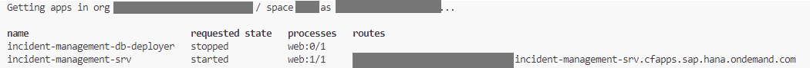

**TODO: Remove hyphens and update screenshots. Also Update the code sample in the teched repo with the same**
# Exercise 9 - Deploy in SAP BTP, Cloud Foundry Runtime

In this exercise we will learn
- How to deploy your CAP application as multi-target application (MTA)

## Introduction

The SAP BTP, Cloud Foundry environment allows you to create polyglot cloud applications in Cloud Foundry. It contains the SAP BTP, Cloud Foundry runtime, which is based on the open-source application platform managed by the Cloud Foundry Foundation.

The SAP BTP, Cloud Foundry environment enables you to develop new business applications and business services, supporting multiple runtimes, programming languages, libraries, and services.

For more information about the Cloud Foundry environment, see [Cloud Foundry Environment](https://help.sap.com/docs/btp/sap-business-technology-platform/cloud-foundry-environment).

## Set up the MTA for deployment

A multitarget application (MTA) is logically a single application comprised of multiple parts created with different technologies, which share the same lifecycle.

The developers of the MTA describe the desired result using the MTA model which contains MTA modules, MTA resources and interdependencies between them. Afterwards, the MTA deployment service validates, orchestrates, and automates the deployment of the MTA, which results in Cloud Foundry (CF) applications, services and SAP-specific contents.

You will use the [Cloud MTA Build Tool](https://sap.github.io/cloud-mta-build-tool/) to deploy the Incident Management application. The modules and services are configured in the **mta.yaml** deployment descriptor file.

1. In SAP Business Application Studio, go to your **IncidentManagement** dev space.

    > Make sure the **IncidentManagement** dev space is in status **RUNNING**.

2. From the root of the **INCIDENT-MANAGEMENT-xxx** project, choose the burger menu, and then choose **Terminal** &rarr; **New Terminal**.

3. Run the following command to generate the **mta.yaml** deployment descriptor:

    ```bash
    cds add mta
    ```

## Configure managed application router

The managed application router enables you to access and run SAPUI5 applications in a cloud environment without the need to maintain your own runtime infrastructure. See [Managed Application Router](https://help.sap.com/docs/btp/sap-business-technology-platform/managed-application-router?version=Cloud).

> See also the documentation about [deploying content with Generic Application Content Deployment](https://help.sap.com/viewer/65de2977205c403bbc107264b8eccf4b/Cloud/en-US/d3e23196166b443db17b3545c912dfc0.html)

1. In SAP Business Application Studio, invoke the Command Palette of the INCIDENT-MANAGEMENT application by choosing the burger menu and then choose **View** &rarr; **Command Palette**. Then, choose **Create MTA Module from Template**.

2. Choose the **Approuter Configuration** module template, and then choose **Start**.

    

3. In the next dialog, in the **Specify a path to the root project** field, choose the **incident-management-xxx** project. Choose **OK**.

4. Choose **Next**.

    

5. In the **Approuter Configuration** step:

      - In the **Select your HTML5 application runtime** dropdown menu, select **Managed Approuter**.  
      - In the **Enter a unique name for the business solution of the project** field, enter **incidents-xxx**.
      > Use your teched user number for `xxx`. Eg., If your teched user name is XP260-001, use 001 as the `xxx`.

      - In the **Do you plan to add a UI?** dropdown menu, select **Yes**.

      

6. Choose **Next**.

7. In the **Action** step, in the **Overwrite incident-management/xs-security.json?** list, select **do not overwrite**.

8. Choose **Finish**.

    

The above steps will generate the following module and resources in the **mta.yaml** file:

```yaml[5-34, 38-59]
_schema-version: '3.1'
...
module:
  ...
- name: incident-management-046-destination-content
  type: com.sap.application.content
  requires:
  - name: incident-management-046-destination-service
    parameters:
      content-target: true
  - name: incident-management-046_html_repo_host
    parameters:
      service-key:
        name: incident-management-046_html_repo_host-key
  - name: incident-management-046-auth
    parameters:
      service-key:
        name: incident-management-046-auth-key
  parameters:
    content:
      instance:
        destinations:
        - Name: incidents_046_incident_management_046_html_repo_host
          ServiceInstanceName: incident-management-046-html5-app-host-service
          ServiceKeyName: incident-management-046_html_repo_host-key
          sap.cloud.service: incidents-046
        - Authentication: OAuth2UserTokenExchange
          Name: incidents_046_incident_management_046_auth
          ServiceInstanceName: incident-management-046-auth
          ServiceKeyName: incident-management-046-auth-key
          sap.cloud.service: incidents-046
        existing_destinations_policy: ignore
  build-parameters:
    no-source: true
  ...
resources:
  ...
- name: incident-management-046-destination-service
  type: org.cloudfoundry.managed-service
  parameters:
    config:
      HTML5Runtime_enabled: true
      version: 1.0.0
    service: destination
    service-name: incident-management-046-destination-service
    service-plan: lite
- name: incident-management-046_html_repo_host
  type: org.cloudfoundry.managed-service
  parameters:
    service: html5-apps-repo
    service-name: incident-management-046-html5-app-host-service
    service-plan: app-host
parameters:
  enable-parallel-deployments: true
build-parameters:
  before-all:
  - builder: custom
    commands:
    - npx cds build --production    
```

- This snippet adds the destinations required by the SAP Build Work Zone service: HTML5 repo host service and xsuaa service
- The `html5-apps-repo` service with plan `app-host` is required to deploy the HTML5 applications to the HTML5 Application Repository.
- Add `ServiceInstanceName: incident-management-046-auth` under `Authentication: OAuth2UserTokenExchange` 


## Add navigation target for Incidents UI

Navigation targets are required to navigate between applications, but also to start applications from SAP Build Work Zone, standard edition. In this step, you add the navigation target **incidents-display** to the application manifest (**manifest.json**) file.

1. In the **Application Info - incidentsxxx** tab, choose the **Fiori Launchpad Config** tile.

    > To open the **Application Info - incidentsxxx** tab: 
    >
    >1. Invoke the Command Palette - **View** &rarr; **Command Palette** or <kbd>Command</kbd> + <kbd>Shift</kbd> + <kbd>P</kbd> for macOS / <kbd>Ctrl</kbd> + <kbd>Shift</kbd> + <kbd>P</kbd> for Windows. 
    >2. Choose **Fiori: Open Application Info**.

2. In the **Fiori Launchpad Configuration** step:

      - In the **Semantic Object** field, enter **incidents-xxx**.
      - In the **Action** field, enter **display**.
      - In the **Title** field, enter **Incident Management**.
      - Choose **Finish**.
      >>Use your teched user number for `xxx`. Eg., If your teched user name is XP260-001, use 001 as the `xxx`.
      

3. Make `incidents-046` to `incidents046` inside the crossNavigation to expose the html5 applciation to content explorer.
This navigation configuration adds the following section in `app/incidents/webapp/manifest.json`:

```json[10-23]
  "sap.app": {
    "id": "ns046.incidents046",
    ...
    "sourceTemplate": {
      ...
    },
    "dataSources": {
      ...
    },
    "crossNavigation": {
      "inbounds": {
        "incidents-046-display": {
          "semanticObject": "incidents-046",
          "action": "display",
          "title": "{{flpTitle}}",
          "subTitle": "{{flpSubtitle}}",
          "signature": {
            "parameters": {},
            "additionalParameters": "allowed"
          }
        }
      }
    }
  }
  ...
```

## Add the UI application

1. In the **Application Info - incidents-xxx** tab, choose the **Add Deploy Config** tile.

    

    > To open the **Application Info - incidents-xxx** tab: 
    >
    >1. Invoke the Command Palette - **View** &rarr; **Command Palette** or <kbd>Command</kbd> + <kbd>Shift</kbd> + <kbd>P</kbd> for macOS / <kbd>Ctrl</kbd> + <kbd>Shift</kbd> + <kbd>P</kbd> for Windows. 
    >2. Choose **Fiori: Open Application Info**.

3. In the **Deploy Configuration** step:

      - In the **Please choose the target** dropdown menu, select **Cloud Foundry**.
      - In the **Destination name** dropdown menu, select **Local CAP Project API**.
      - In the **Editing the deployment configuration will overwrite existing configuration, are you sure you want to continue?** field, choose **Yes**.
      - Choose **Finish**.


      


This deploy configuration adds SAP Cloud service at the end of `app/incidents/webapp/manifest.json`:

```json
 "sap.cloud": {
    "public": true,
    "service": "incidents-046"
  }
```

In addition, in the **mta.yaml** file, new modules have been generated and the resources have been updated:

```yaml[5-28, 36-51, 57, 61]
_schema-version: '3.1'
...
module:
  ...
- name: incident-management-046-app-content
  type: com.sap.application.content
  path: .
  requires:
  - name: incident-management-046_html_repo_host
    parameters:
      content-target: true
  build-parameters:
    build-result: resources
    requires:
    - artifacts:
      - ns046incidents046.zip
      name: ns046incidents046
      target-path: resources/
- name: ns046incidents046
  type: html5
  path: app/incidents-046
  build-parameters:
    build-result: dist
    builder: custom
    commands:
    - npm install
    - npm run build:cf
    supported-platforms: []
resources:
... 
- name: incident-management-046-destination-service
  type: org.cloudfoundry.managed-service
  parameters:
    config:
      HTML5Runtime_enabled: true
      init_data:
        instance:
          destinations:
          - Authentication: NoAuthentication
            Name: ui5
            ProxyType: Internet
            Type: HTTP
            URL: https://ui5.sap.com
          - Authentication: NoAuthentication
            HTML5.DynamicDestination: true
            HTML5.ForwardAuthToken: true
            Name: incident-management-046-srv-api
            ProxyType: Internet
            Type: HTTP
            URL: ~{srv-api/srv-url}
          existing_destinations_policy: update
      version: 1.0.0
    service: destination
    service-name: incident-management-046-destination-service
    service-plan: lite
  requires:
  - name: srv-api
- name: incident-management-046_html_repo_host
  ...
parameters:
  deploy_mode: html5-repo
  ...  
```

> This snippet added as an artifact in application content **ns046incidents046** which is an HTML5 application.

## Assemble with the Cloud MTA Build Tool

Run the following command to assemble everything into a single `mta.tar` archive:

```bash
mbt build
```

Once build is successfull a mtar will be created inside folder mta_archives.

See [Multitarget Applications in the Cloud Foundry Environment](https://help.sap.com/products/BTP/65de2977205c403bbc107264b8eccf4b/d04fc0e2ad894545aebfd7126384307c.html?locale=en-US) to learn more about MTA-based deployment.

## Deploy in the SAP BTP, Cloud Foundry runtime

1. From the root of the **INCIDENT-MANAGEMENT** project, choose the burger menu, and then choose **Terminal** &rarr; **New Terminal**.

2. Log in to your subaccount in SAP BTP:

    ```bash
    cf api <API-ENDPOINT>
    ```

    > You can find the API endpoint in the **Overview** section of your subaccount in the SAP BTP cockpit.

3. Run command to login into cf:

    ```bash
    cf login --sso
    ```

    you can see **Temporary Authentication Code** URL on the terminal. Copy URL and open it in new tab.

    

4. You will see login page. Enter origin key of your identity provider key as **tdct3ched1-platform** and click on **Sign in    with alternate identity provider**.

    

5. Temporary Authentication code will be generated.

    

6. Copy temporary Authentication Code and paste into cf login terminal. You will see success message.

    

7. Navigate to the **mta_archives** folder and run the following command to deploy the generated archive to the SAP BTP, Cloud Foundry runtime:

    ```bash
    cf deploy mta_archives/incident-management-046_1.0.0.mtar 
    ```

8. Check if all services have been created:

    ```bash 
    cf services
    ```

    You should see the following services in your space:

    

9. Check if the apps are running:

    ```bash
    cf apps
    ```

    

10. Enter the route displayed for **incident-management-046-srv** in your browser.

    

    You see the CAP start page:

    

11. When you choose the **Incidents** service entity, you will see an error message. 

    

The service expects a so called JWT (JSON Web Token) in the HTTP Authorization header that contains the required authentication and authorization information to access the service. In the next tutorial, you will access your UIs from SAP Build Work Zone, standard edition. The SAP Build Work Zone, standard edition will trigger the authentication flow to provide the required token to access the service.
