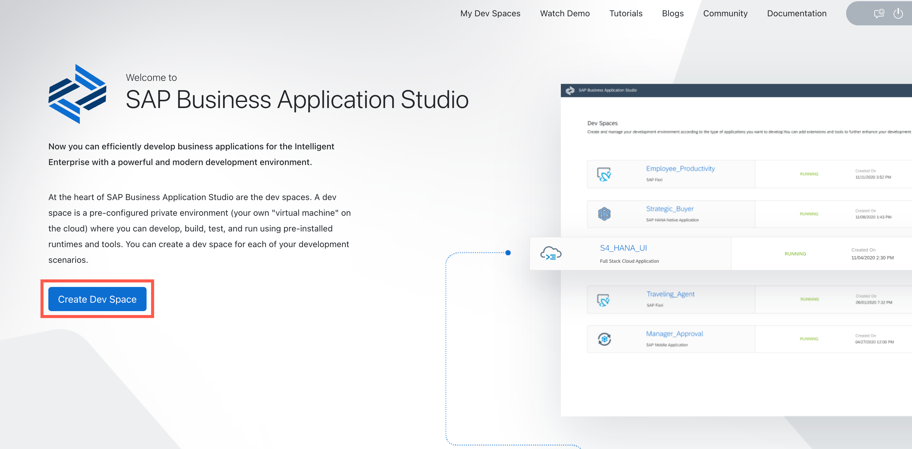
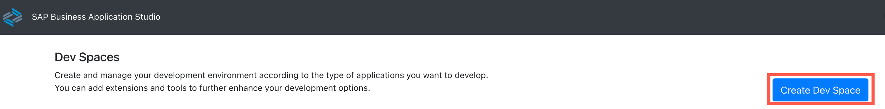
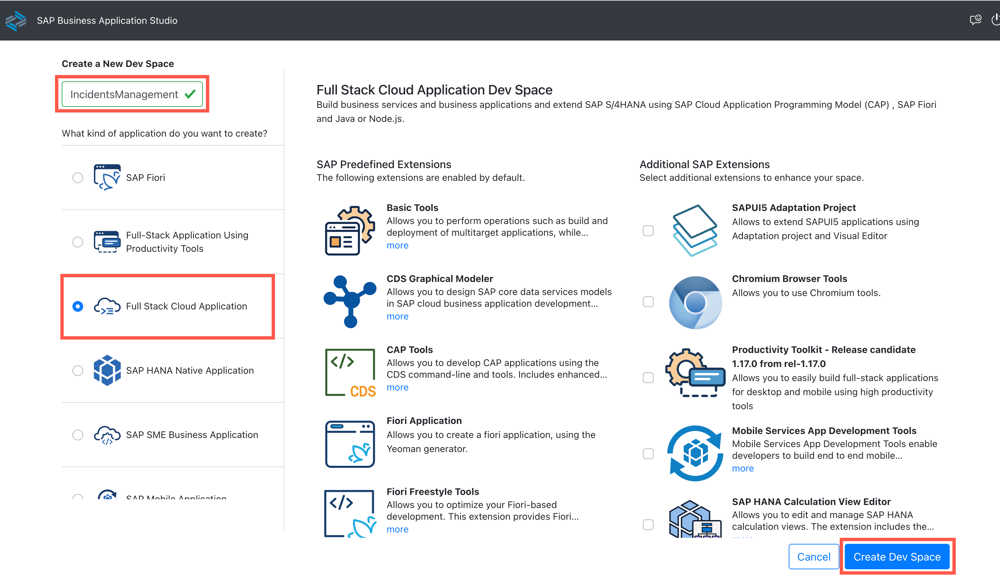
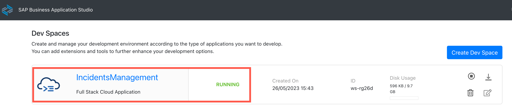

# Exercise 1 - Create Dev Space in SAP Business Application Studio

In this exercise, we will create a development space in SAP Business Application Studio.

1. Navigate to your subaccount and choose **Services** &rarr; **Instances and Subscriptions**.

2. Choose the **SAP Business Application Studio** subscription. SAP Business Application Studio opens in a new tab of the browser.

3. Choose **Create Dev Space**.

    If you haven't created a dev space, the welcome page for SAP Business Application Studio loads.

    

    If this isn't the first dev space, the dev space manager for SAP Business Application Studio loads.

    

    > If you create a bookmark to this page, it's easy to get back to SAP Business Application Studio later.

4. Enter a **Dev Space Name** (For example, **IncidentManagement**).

5. Choose the **Full Stack Cloud Application** template and then choose **Create Dev Space**.

    

    > Creating your dev space might take some minutes.

6. As soon as your dev space is in status **Running**, you can click its name to open it.

    

## Summary

You've now created a development space in SAP Business Application Studio.

Continue to - [Exercise 2 - Build a CAP application](../Build%20a%20CAP%20Application/README.md)

