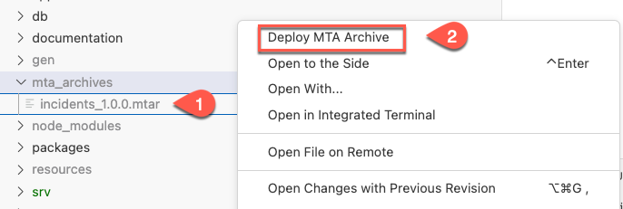

# Exercise 15 - Test the end to end application
In this exercise you will learn
- how to configure SAP S/4HANA extensibility service in mta
- Deploy the application to Cloud Foundry

## Deploy and Run the Application on Cloud Foundry with SAP S/4HANA Cloud Backend

1. Add the below code snippet to package.json
```json
"API_BUSINESS_PARTNER": {
        "kind": "odata-v2",
        "model": "srv/external/API_BUSINESS_PARTNER",
        "[production]": {
          "credentials": {
            "destination": "incidents-api-access"
          }
        }
      }
```

2. In mta.yaml file under **incidents-mgmt-srv** module requires section add **- name: incidents-mgmt-xxx-destination-service**
   
    ```yaml
    - name: incidents-mgmt-srv
      type: nodejs
      path: gen/srv
      requires:
      - name: incidents-mgmt-auth
      - name: incidents-mgmt-db
      - name: incidents-mgmt-046-destination-service
    ....
    ```
>Use your teched user number for `xxx`. Eg., If your teched user name is XP260-001, use 001 as the `xxx`.

3. Right-click the mta.yaml file and choose **Build MTA Project**
   
   

4. If the build was successful, you find the generated file in the mta_archives folder. Right-click on incidents_1.0.0.mtar and select **Deploy MTA Archive**  
   
   

5. Login to your SAP BTP subaccount and space to start the deployment.
   
   

   

You have to [Assign Application Roles](../User%20Role%20Assignment/README.md) to be able to access the application via the URL.
