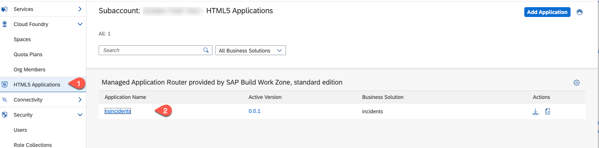
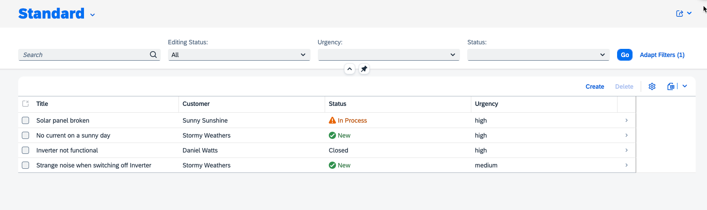
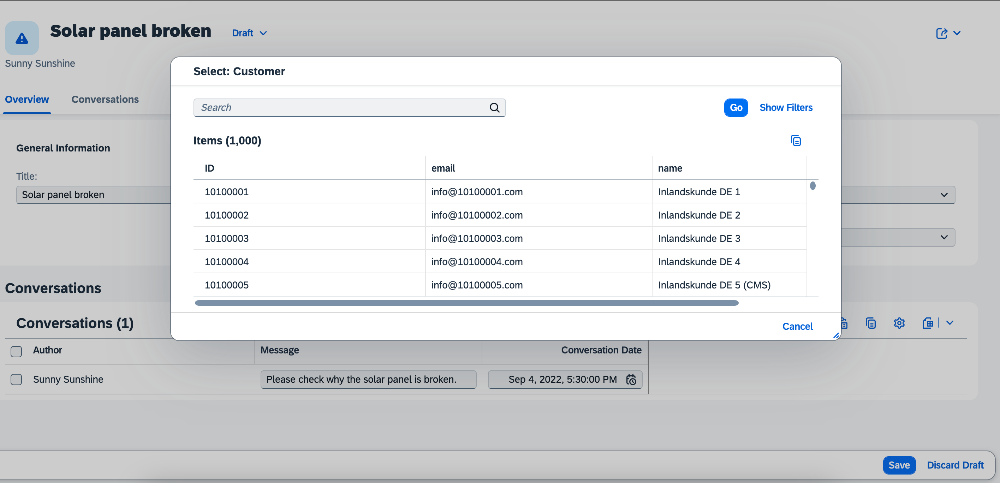

# Exercise 16 - Test the end to end flow

In this exercise you will learn
- Testing the deployed application

## Run and Test the applicaion

1. In your SAP BTP Cockpit of your subaccount choose **HTML5 Applications** - You get a list of the deployed HTML5 applications. Select the Incident Management Application

   

2. The application starts and you should be able to create a new incident.
   
   

3. Value help for customers gets the data from SAP S/4HANA Cloud.

    

## Summary

Congratulation! You have successfully developed, configured and deployed the Incidenent Management Application using an external service.