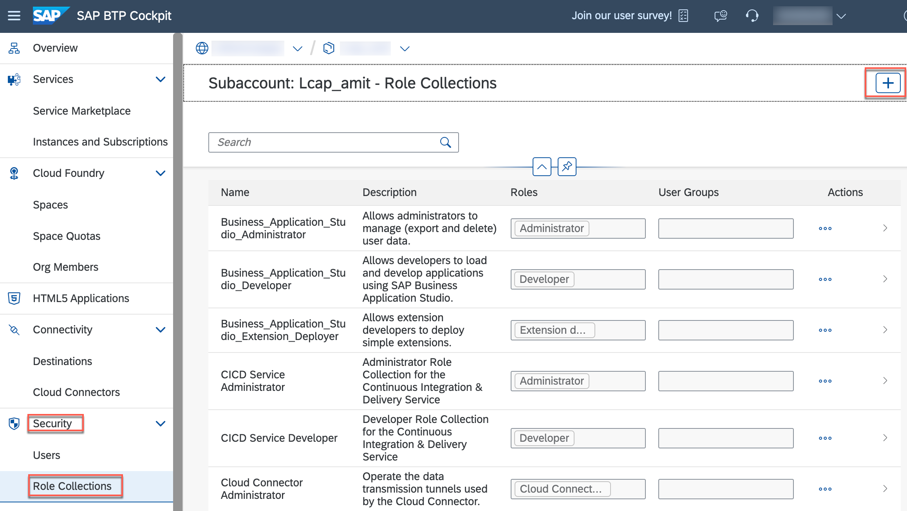
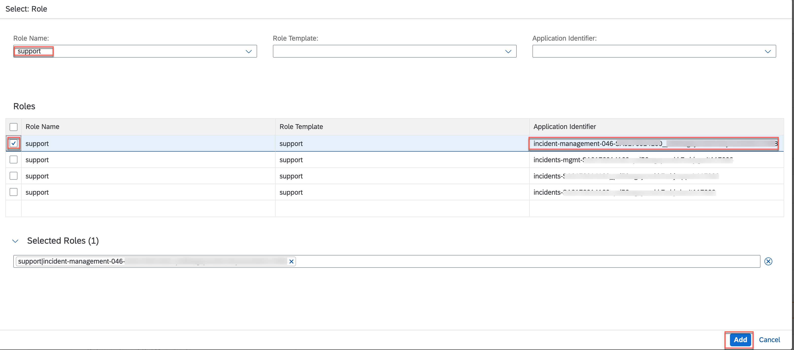
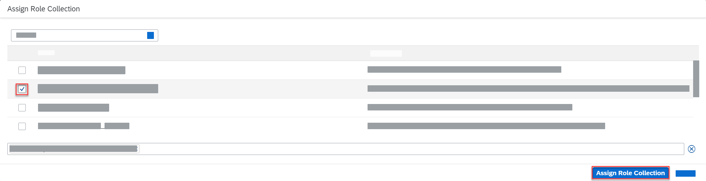

# Exercise 10 - User Role Assignment

In this exercise we will learn
- How to create and assign a role collection in the SAP BTP subaccount.

## Create a role collection and add role

1. Open the SAP BTP cockpit and navigate to your subaccount.

1. Choose **Security** &rarr; **Role Collections**, and then choose the icon to create a new role collection.

      

2. In the **Create Role Collection** dialog, enter **Incident Management Support-xxx** in the **Name** field and choose **Create**.
      >Use your teched user number for `xxx`. Eg., If your teched user name is XP260-001, use 001 as the `xxx`.

      

3. Choose the role collection **Incident Management Support-xxx** from the list of role collections and choose **Edit** on the right.

4. Open the value help in the **Role Name** field.

5. Search for the role **support**, select it, and choose **Add**.

6. Choose **Save**.

      > You can identify your role using `Application Identifier` as shown below. 
      
      

### Assign a role collection to a user

1. Choose **Security** &rarr; **Users**, and then choose a user from the list.

2. Under **Role Collections** on the right, choose **Assign Role Collection**.

      

2. In the **Assign Role Collection** dialog, select the **Incident Management Support-xxx** role collection and choose **Assign Role Collection**.

      