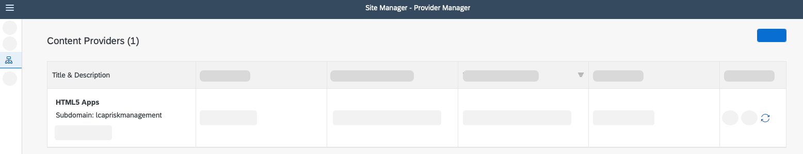
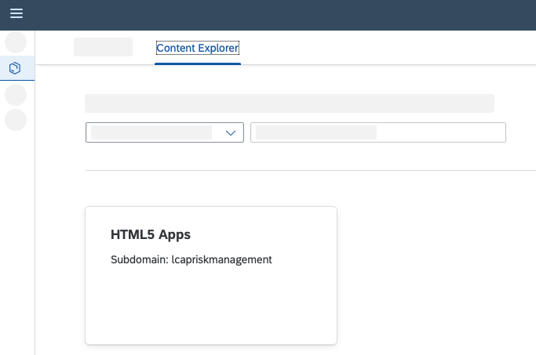
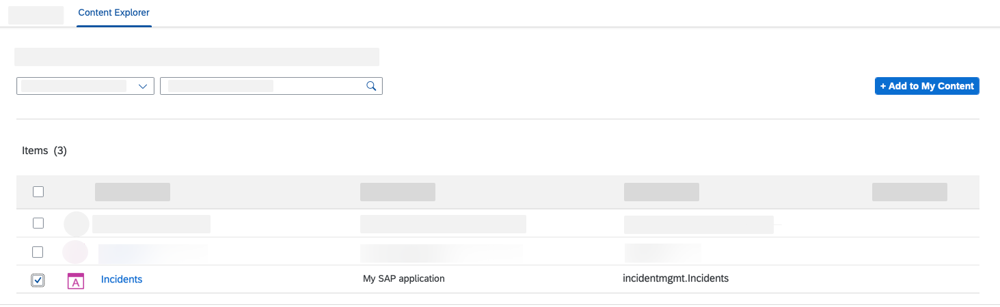
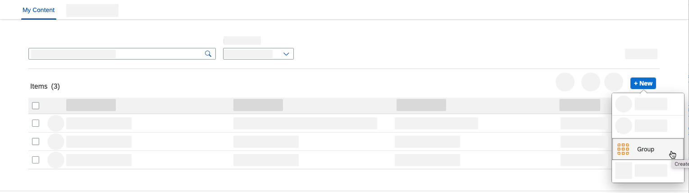
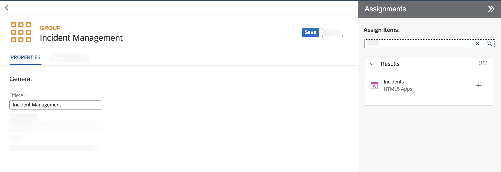
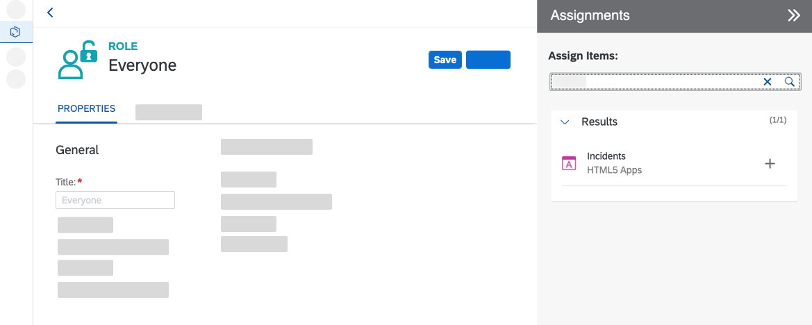
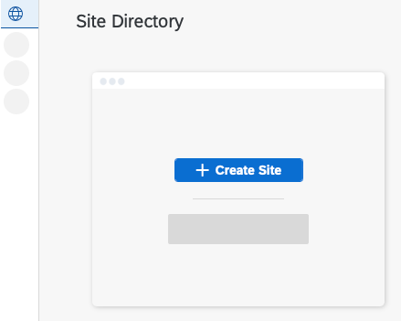
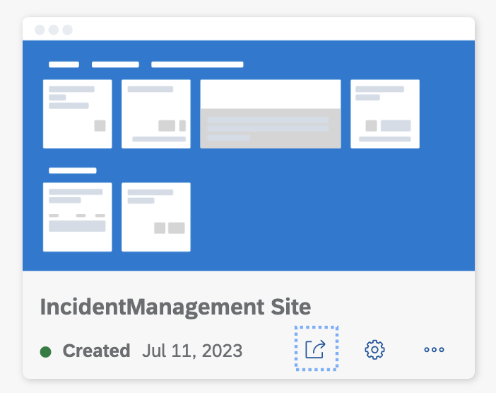
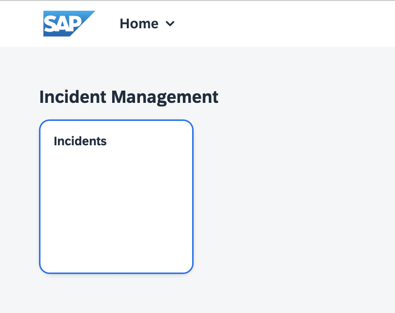

# Exercise 11 - Integrate Your Application with SAP Build Work Zone, Standard Edition

In this exercise you will learn
- How to integrate with SAP Build Work Zone, standard edition to your application

##  Integrate with SAP Build Work Zone, standard edition

### Update content

1. Open your subaccount and search for **Instances and Subscriptions**.

2. Search for the application **SAP Build Work Zone, standard edition** and choose the icon to open it.

3. In the menu on the left side choose the icon for **Channel Manager**.

4. Choose the refresh icon to fetch the updated content.

   

#### Add application to Content Explorer

5. Choose **Content Manager** in the menu on the left and choose the **Content Explorer** button.

6. Select the tile **HTML5 Apps** with your respective subdomain name.

    

7. In the items table, set checkmark for the app **Incidents** and choose the button **Add**.

    

#### Create a group

8. Go to the **Content Manager** tab, choose **Create** and select **Group** from dropdown.

    

9. Add the title **Incident Management xxx Group**.
> Use your teched user number for `xxx`. Eg., If your teched user name is XP260-001, use 001 as the `xxx`.

10. Assign items in the Assignment Status. Search for **Incident** and choose the slider icon to assign the app.

11. Choose **Save**.

    

#### Add application to the Everyone role

12. Back in the **Content Manager**, choose role **Everyone** and **Edit**.

13. Assign items in the Assignment Status. Search for **Incident** and choose the Slider icon to assign the app.

14. Choose **Save**.

    

#### Create site

15. In the menu on the left side navigate to **Site Directory**.

16. Choose button **Create Site**.

     

17. Enter the site name as **IncidentManagement xxx Site** and choose **Create**.
> Use your teched user number for `xxx`. Eg., If your teched user name is XP260-001, use 001 as the `xxx`.

18. Now, you are forwarded to your created site.

#### Test your site

19. Navigate to **Site Directory**.

20. Find your created site.

    

21. Open it by choosing **Go to site**.

    
 
## Summary

Congratulations! You now have finished the development of your application and you have integrated SAP Build Work Zone, standard edition service, to have one central entry point to show all of your SAP BTP applications.
