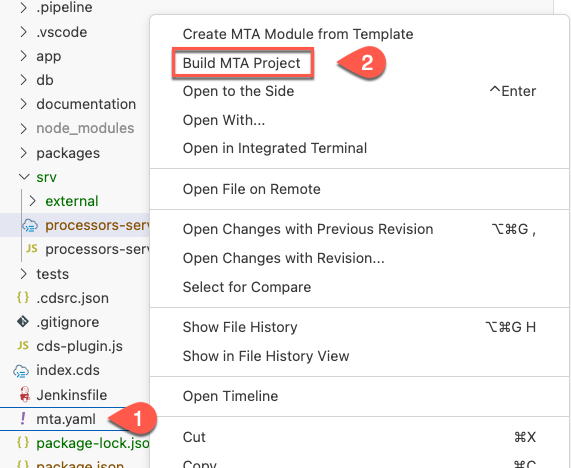

# Exercise 15 - Test the end to end application
In this exercise you will learn
- how to configure SAP S/4HANA extensibility service in mta
- Deploy the application to Cloud Foundry

## Deploy and Run the Application on Cloud Foundry with SAP S/4HANA Cloud Backend

1. Create a new file called `bupa.json` and paste the below code to ti
    ```json
    {
    "systemName": "teched-grs",
    "communicationArrangement": {
        "communicationArrangementName": "inci",
        "scenarioId": "SAP_COM_0008",
        "inboundAuthentication": "BasicAuthentication",
        "outboundAuthentication": "BasicAuthentication",
        "outboundServices": [
            {
                "name": "Replicate Customers from S/4 System to Client",
                "isServiceActive": false
            },
            {
                "name": "Replicate Suppliers from S/4 System to Client",
                "isServiceActive": false
            },
            {
                "name": "Replicate Company Addresses from S/4 System to Client",
                "isServiceActive": false
            },
            {
                "name": "Replicate Workplace Addresses from S/4 System to Client",
                "isServiceActive": false
            },
            {
                "name": "Replicate Personal Addresses from S/4 System to Client",
                "isServiceActive": false
            },
            {
                "name": "Business Partner - Replicate from SAP S/4HANA Cloud to Client",
                "isServiceActive": false
            },
            {
                "name": "Business Partner Relationship - Replicate from SAP S/4HANA Cloud to Client",
                "isServiceActive": false
            },
            {
                "name": "Business Partner - Send Confirmation from SAP S/4HANA Cloud to Client",
                "isServiceActive": false
            },
            {
                "name": "BP Relationship - Send Confirmation from SAP S/4HANA Cloud to Client",
                "isServiceActive": false
            }
        ],
        "communicationSystem": {
            "communicationSystemHostname": "default.com",
            "outboundCommunicationUser": {
                "username": "DefaultUser",
                "password": "DefaultPassword"
            }
        }
    }
}
    ```

2. Add the below code snippet to package.json
```json
"API_BUSINESS_PARTNER": {
        "kind": "odata-v2",
        "model": "srv/external/API_BUSINESS_PARTNER",
        "[production]": {
          "credentials": {
            "destination": "incidents-api-access-xxx",
            "path": "/sap/opu/odata/sap/API_BUSINESS_PARTNER"
          }
        }
      }
```
>>Use your teched user number for `xxx`. Eg., If your teched user name is XP260-001, use 001 as the `xxx`.

3. Add SAP S/4HANA Cloud API access service. Right-click the mta.yaml file and choose **Open with ... - Text Editor**.

4. Add the following code snippet to the resource section

    ```yaml
    - name: incidents-api-access-xxx
        type: org.cloudfoundry.managed-service  
        parameters:
          path: ./bupa.json
          service: s4-hana-cloud
          service-plan: api-access
          system-name: <system-name>
    ```
>>Use your teched user number for `xxx`. Eg., If your teched user name is XP260-001, use 001 as the `xxx`.
**Note** - As **system-name** you must enter the name of your the registered SAP S/4HANA Cloud system.

5. In the incidents-mgmt-srv module requires section add **- name: incidents-mgmt-xxx-destination-service**
   
    ```yaml
    - name: incidents-mgmt-srv
      type: nodejs
      path: gen/srv
      requires:
      - name: incidents-mgmt-auth
      - name: incidents-mgmt-db
      - name: incidents-mgmt-046-destination-service
    ....
    ```
>>Use your teched user number for `xxx`. Eg., If your teched user name is XP260-001, use 001 as the `xxx`.

6. Right-click the mta.yaml file and choose **Build MTA Project**
   
   

7. If the build was successful, you find the generated file in the mta_archives folder. Right-click on incidents_1.0.0.mtar and select **Deploy MTA Archive**  
   
   

8. Login to your SAP BTP subaccount and space to start the deployment.
   
   

   

You have to [Assign Application Roles](../ex10/README.md) to be able to access the application via the URL.
